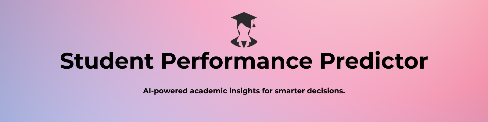
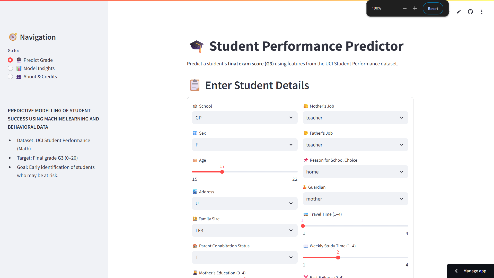
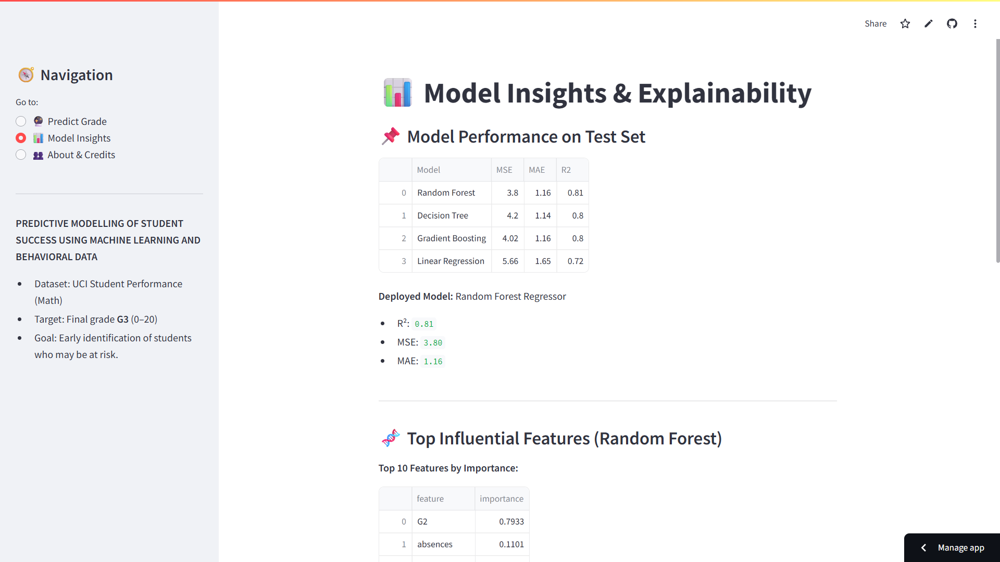
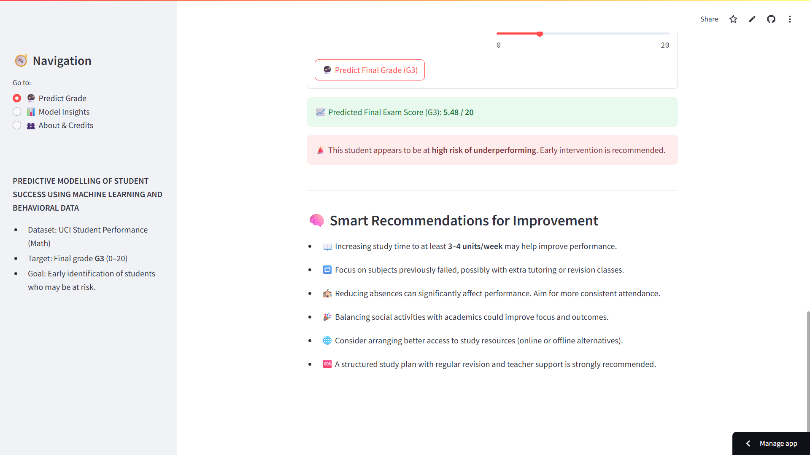

  

# ✨ STUDENT PERFORMANCE PREDICTOR  
*A Machine Learning Web App to Predict Final Exam Scores (G3)*

---

## 🎯 **Project Overview**

The **Student Performance Predictor** uses machine learning to estimate a student's **final exam score (G3)** based on diverse academic, demographic, and behavioral factors from the UCI Student Performance dataset.

The purpose is early identification of **at-risk students**, enabling proactive academic support.

---

## 🚀 **Live Demo**

🔗 **Streamlit Application:**  
https://studentperformancepredictor-ix2kp5fyavjdeyin7umtnt.streamlit.app/

---

## 🧠 **Features**

- Predict final exam grade **G3 (0–20)**
- 40+ academic & behavioral inputs
- Smart recommendations for improving performance
- Model insights and feature importance visualization
- Clean, mobile-friendly Streamlit UI
- Fully deployed and production-ready

---

## 🖼️ **App Preview**

### 🔮 Prediction Page  

### 📊 Model Insights  

### 🧠 Recommendations  

---

## 🛠 Installation

git clone https://github.com/Viole-0/student_performance_predictor.git

cd student_performance_predictor

pip install -r requirements.txt

streamlit run streamlit_app/app.py

---

## 🛠 **Tech Stack**

- Python  
- Streamlit  
- Scikit-Learn  
- Pandas  
- NumPy  
- Matplotlib  
- Joblib  

---

## 📁 Project Structure

student_performance_predictor/ 

├─ models/ 

│ ├─ random_forest_model.pkl 

│ ├─ trained_feature_names.pkl 

│ ├─ model_performance_summary.csv 

│ └─ feature_importances_rf.csv 

│ 

├─ streamlit_app/ 

│ └─ app.py 

│ 

├─ notebooks/ 

│ ├─ 01_data_exploration.ipynb 

│ ├─ 02_eda_visualizations.ipynb 

│ └─ 03_modeling_and_prediction.ipynb 

│ 

├─ data/ 

│ └─ student-mat.csv 

│ 

├─ requirements.txt 

└─ README.md 

#There are some dummy files too to test cases...

Final test — Groq Summoner should comment now.

